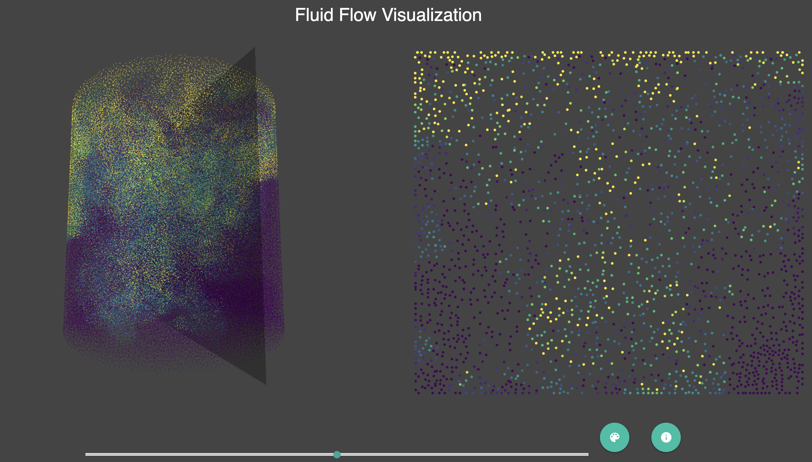

# Viscous Fingers in Fluid interactive Visualization
This interactive visualization application is created with three.js and d3.js.

The dataset comes from an experiment of viscous fingers by the San Diego Supercomputing Center

[Go to the application](https://mirkomantovani.com/three/index.html)

